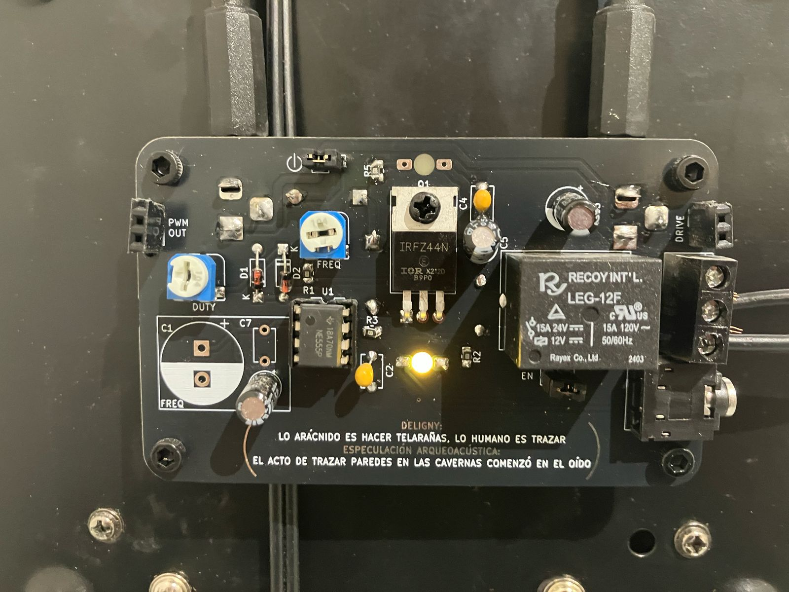
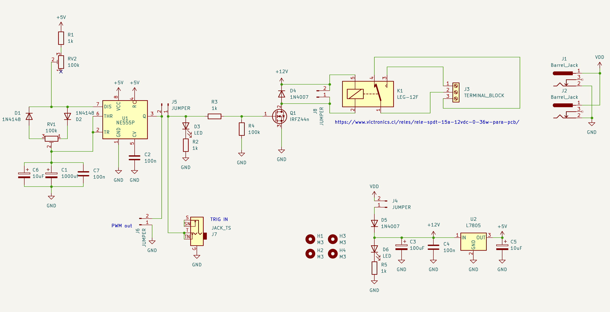
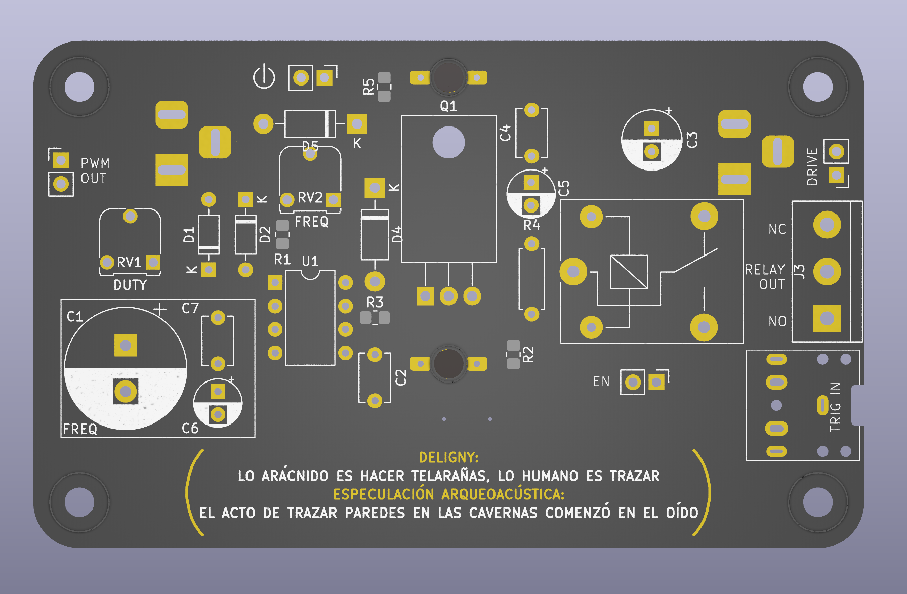
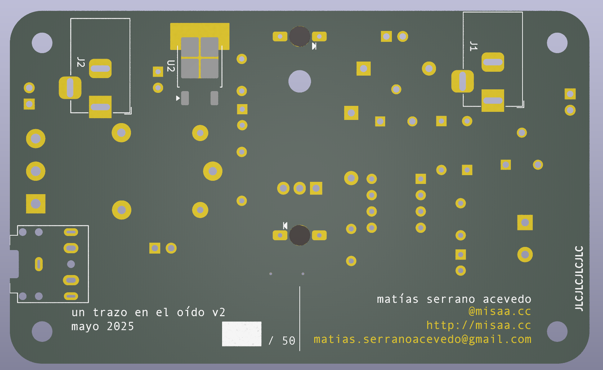

# ruidoRupestre

**Tarjeta de presentación**

Circuito activador de relay en base a 555 en modo astable y control PWM

También utilizada en obra ["Un trazo en el oído"](https://misaa.cc/projects/untrazoeneloido.html) (MAC 2025), conectando su salida en serie para activar/desactivar una bobina que generaba un feedback electromagnético

## Esquemático

- Control de frecuencia y ciclo de trabajo para encendido y apagado de relés u otro tipo de señales de driver

- Con Jumper en EN, se habilita relé

- Se pueden conectar otro tipo de motores conectados a DRIVE (con el cuidado de tener desconectado el jumper EN)

- En PWM OUT se obtiene la salida directamente del control a través del 555

- A través del jack de audio se pueden enviar señales de onda cuadrada que gatillen el relé/motor

- Solo se debe instalar uno de los 3 condensadores para controlar la velocidad: C7 para frecuencias altas, C6 para cambios entre 15-30 segundos (100uF), C1 para tiempos mucho mas lentos (más de 1 min)

- Se puede estimar el timing máximo y mínimo de salida con la [calculadora de modo astable](https://ohmslawcalculator.com/555-astable-calculator), asumiendo:

    - R1 de 1k (tiempo mínimo) o 100k (tiempo máximo)
    - R2 de 100k
    - C de tamaño de preferencia (poblando C1, C6 o C7)

## BOM

| Referencia  | Valor          | Huella                                        | Cantidad |
|-------------|----------------|-----------------------------------------------|----------|
| R1,R2,R3,R5 | 1k             | Resistencia SMD 0805                          |        4 |
| U1          | Socket         | DIP-8                                         |        1 |
| U2          | L7805          | Regulador de voltaje TO-252                   |        1 |
| R4          | 100k           | Resistencia THT                               |        1 |
| D1,D2       | 1N4148         | Diodo                                         |        2 |
| D4,D5       | 1N4007         | Diodo                                         |        2 |
| C2,C4,C7    | 100n           | Condensador                                   |        3 |
| C1          | 1000uf         | Condensador electrolítico                     |        1 |
| C3          | 100uF          | Condensador electrolítico                     |        1 |
| C5,C6       | 10uF           | Condensador electrolítico                     |        2 |
| D3,D6       | LED            | Led 3mm                                       |        2 |
| J4,J5,J6,J8 | JUMPER         | Pin Header                                    |        4 |
| J1,J2       | Barrel_Jack    | Connector_BarrelJack:BarrelJack_Horizontal    |        2 |
| J3          | TERMINAL_BLOCK | TerminalBlock:TerminalBlock_bornier-3_P5.08mm |        1 |
| J7          | JACK_TS        | Jack SJ-3525N                                 |        1 |
| K1          | LEG-12F        | Relé 12V                                      |        1 |
| Q1          | IRFZ44n        | Transitor MOSFET TO-220                       |        1 |
| RV1,RV2     | 100k           | Trimpot RM-065                                |        3 |
| U1          | NE555P         | DIP-8                                         |        1 |

